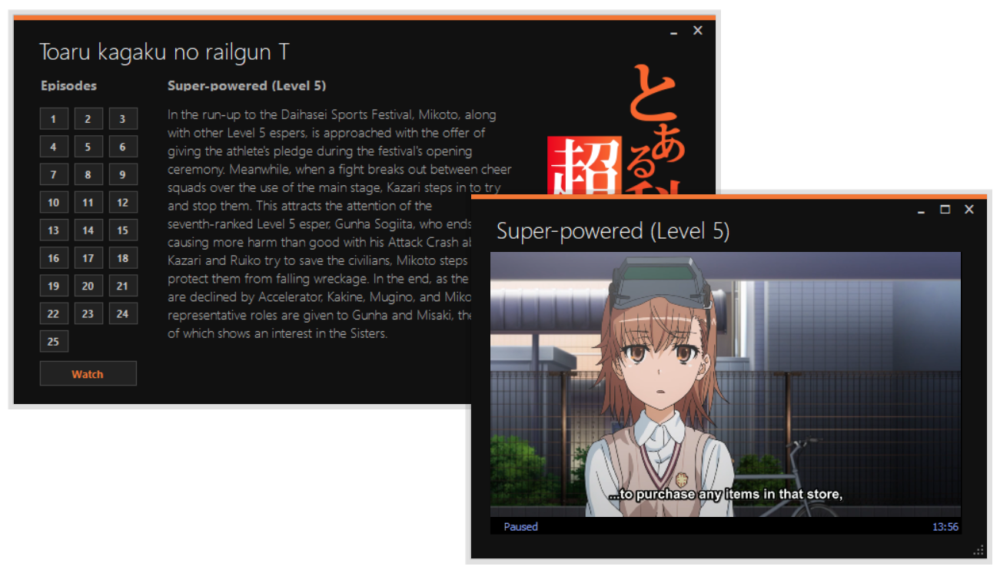

# Misaka Anime Player
Anime player for "Toaru kagaku no railgun T" anime written in C#.

     
    

## Episodes
* Super-powered (Level 5)
* The Daihasei Festival
* Balloon Hunter
* Tampering
* Trust
* The Battle Begins
* Auribus oculi fideliores sunt. (The eyes are more trustworthy than the ears)
* Railgun x Mental Out
* Kozaku Mitori
* Clone Dolly
* Joining the Battle
* Exterior
* SYSTEM (Those Who Arrive at Heaven's Will in an Only Human Body)
* Dragon Strike (Jaw of the Dragon King)
* Promise
* Dream Ranker
* Precognition
* Bust Upper
* Strange Coincidence
* Ha det bra
* Doppelganger
* Scavenger
* Possession
* Diffusion
* My Dear Friends
